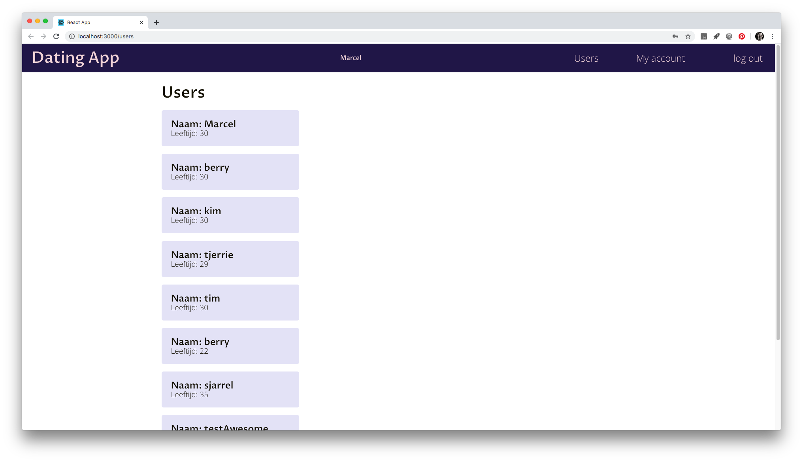
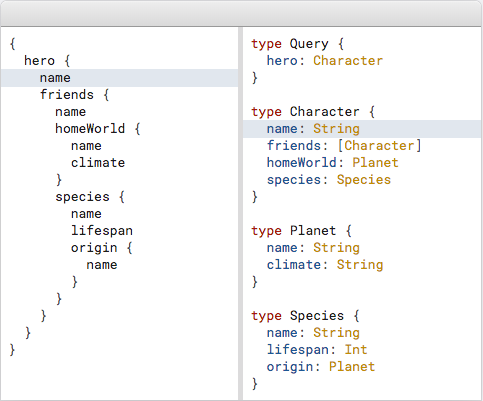
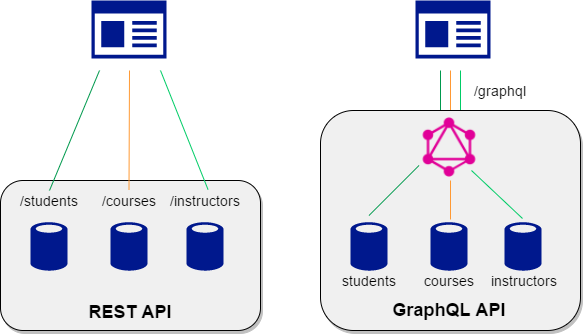

# Project Tech



## Inhoudsopgave

- [De Opdracht](#De-Opdracht)
- [User story](#User-Story)
  - [De Uitdaging](#De-uitdaging)
  - [Waarom Graphql?](#Waarom-graphql?)
  - [Wat is Graphql?](#Wat-is-Graphql?)
- [Het verschil tussen graphql en een Rest api](#Het-verschil-tussen-graphql-en-een-Rest-api)
  - [Rest api](#Rest-api)
  - [Graphql](#Graphql)
- [Hoe werkt mijn prototype?](#Hoe-werkt-mijn-prototype?)
- [Wanneer kies je voor GraphQL boven Rest?](#Wanneer-kies-je-voor-GraphQL-boven-Rest?)
  - [De voordelen van graphql](#De-voordelen-van-Graphql)
  - [De nadelen van Graphql](#De-nadelen-van-Graphql)
- [Reflectie](#Reflectie)
- [Bronnen](#Bronnen)

## De Opdracht

Een User story uitwerken in een klikbaar prototype. Het prototype moet een frontend bevatten, een backend server en een koppeling met een database.

## User Story

Als gebruiker wil ik een account kunnen aanmaken, zodat ik vervolgens kan inloggen op de app om alle content te bekijken die alleen voor leden toegankelijk is.

### De uitdaging

Het vak Project Tech stond tevens in het teken van het aangaan van nieuwe uitdagingen. Daarom heb ik er voor gekozen om een simpele api te bouwen met behulp van GraphQl.

### Waarom graphql?

Tijdens mijn stage bij Label A hoorde ik voor het eerst van Graphql. Het was een techniek waar een van de backend-end developers enthousiast van werdt. Vervolgens kwam ik de term vaker tegen op sites zoals dev.to, Reddit en Fireship.io. Vervolgens besloot ik er steeds meer over te lezen. In eerste opzicht leek Graphql een interessante tegenhanger van een REST Api en de online community leek zeer enthousiast. Bij Project Tech werd gevraagd om een uitdaging aan te gaan en iets nieuws te leren, dit leek mij dan een perfecte gelegenheid om graphql uit te zoeken.

Aan de hand van dit onderzoek heb ik een kleine readme geschreven waarin ik vooral reflecteer op de verschillen tussen Rest en Graphql

### Wat is Graphql?

Graphql is een query taal voor een API. Dit wil zeggen dat Graphql de API een manier biedt om in een string precies aan te geven welke data je wilt opvragen en wat Graphql als response terug moet geven. De meest voorkomende verkeerde opvatting over graphql, is dat het een query language is voor databases. Omdat het voor API's is het niet afhankelijk van welke database er wordt gebruikt. Het heeft zelfs niet eens een database nodig om te werken.



In het bovenstaande voorbeeld zie je hoe uitgebreid een query kan worden opgebouwd. Ieder object die je opvraagt als response in je query is opzich ook weer strict typed zien. Je ziet dat een Hero van het type character is, die vervolgens een naam heeft als een string. Planet is ook een type, die opzich ook een string als name heeft. Etc.
Wanneer je een query zoals deze voor jezelf uittekent, snap je waar de naam Graphql vandaan komt. Alles lijkt als een soort boomdiagram in elkaar opgebouwd.

## Het verschil tussen graphql en een Rest api



In de bovenstaande afbeelding zie je een van de verschillen tussen Rest en GraphQL. Om students, courses en instructors te tonen moet er met een rest api drie endpoints worden aangesproken. Met Graphql maar een. Hieronder zal ik deze werkwijze meer toelichten

Een REST Api werkt met endpoints waarin de data die er wordt teruggegeven aan de client, al bepaald is. Bijvoorbeeld:

`https://jsonplaceholder.typicode.com/users/`

### Rest api

Als je bijvoorbeeld een lijst met Users opvraagt via deze endpoint, krijg je een array met User objecten terug zoals deze is bepaald door de backend-end developer. De array met users, bevat voor elke user een object met daarin alle properties die onder een user object vallen.
Stel dat je een array met Users wilt ontvangen, waarin alleen de voornamen en usernames van een user staan vermeld in het object. Zou de backend-developer daar een aparte endpoint voor moeten schrijven. Je zou als developer natuurlijk ook de endpoint kunnen gebruiken waarin de Users array met hun individuele objecten en properties wordt teruggegeven. Echter, je vraagt teveel data op voor datgene wat je wilt laten zien op je scherm.

```json
[
{
    "id": 1,
    "name": "Leanne Graham",
    "username": "Bret",
    "email": "Sincere@april.biz",
    "address": {
      "street": "Kulas Light",
      "suite": "Apt. 556",
      "city": "Gwenborough",
      "zipcode": "92998-3874",
      "geo": {
        "lat": "-37.3159",
        "lng": "81.1496"
      }
    },
    "phone": "1-770-736-8031 x56442",
    "website": "hildegard.org",
    "company": {
      "name": "Romaguera-Crona",
      "catchPhrase": "Multi-layered client-server neural-net",
      "bs": "harness real-time e-markets"
    }
  },...
]
```

### Graphql

Grapql biedt je 1 endpoint waar je een querystring naar kan sturen. In deze string geef je precies aan welke data je wilt hebben. De graphql laag leeft als het ware tussen de api en de client in. Op basis van wat er in de query string wordt meegegeven, zoekt Graphql alle data bij elkaar. Deze data, en alleen de data gespecificeerd in de query, wordt teruggegeven.

```javascript
// endpoint
'https://json-placeholder-graphql.herokuapp.com/graphql'

// dit is de query die als GET request verstuurd wordt naar de graphql endpoint.  Elke query start met het keyword 'query'. Vervolgens stel je zelf een query samen.  In de query specificeer je welke data de response moet bevatten.

const query = {
  '
  query {
    users {
      name
      username
    }
  }
	'
}

// response
 "data": {
    "users": [
      {
        "name": "Leanne Graham",
        "username": "Bret"
      },
      {
        "name": "Ervin Howell",
        "username": "Antonette"
      },...

```

## Hoe werkt mijn prototype?


*Als gebruiker wil ik een account kunnen aanmaken, zodat ik vervolgens kan inloggen op de app om alle content te bekijken die alleen voor leden toegankelijk is.*

#### Stack

- Express server
- MongoDb. Hier heb ik een cloud oplossing voor gebruikt. [MongoDB cloud](https://www.mongodb.com/cloud)
- Frontend framework React

#### Aanmaken van gebruiker

Voor het toevoegen van een gebruiker aan Mongodb met behulp van Graphql moet je eerst een schema voorzien. Zo weet de server welke data moet worden verzonden in de query eveneens het datatype van elk property van het object. In ons geval een User.

Voor het aanmaken en wijzigen van data gebruik je binnen Graphql een `mutation`. Deze is als volgt opgesteld.
`createUser(userInput: UserInput): User`

de CreateUser mutation neemt als input `userInput`. Hier komt alle data in terecht die de gebruiker verstuurd naar de server bij het submitten van de form. `UserInput` wordt gedefineerd als input. De input moet vervolgens bestaan uit de data die is defineerd binnen je Schema's. Vervolgens wordt er een `User` object als response gegeven.

```javascript
type User {
	id: ID!
	email: String!
	password: String
	city: String
	age: Int
	name: String
}

input UserInput {
	email: String!
	password: String!
	age: Int
	city: String
	name: String
}
```

Aan de frontend zijde kan er bij een form submit een query worden samengesteld. Deze moet alle data bevatten die in het schema met `!` is aangegeven. Dit houdt in dat deze data required is om te versturen naar de mongo database.

```Javascript
const reqBody = {
  query: `
		mutation {
			createUser(userInput: {email: "${email}", password: "${password}", age: ${age}, name:"${name}", city: "${city}"}) {
				id
				email
			}
		}
	`
};
```

In de bovenstaande mutation geven we aan dat we  `id` en `email`  als response willen ontvangen wanneer de mutation succesvol is. De Id en email gebruik in dit geval om de gebruiker in te loggen op de applicatie.

Met behulp van [Bcrypt](https://www.npmjs.com/package/bcrypt) hashen we het wachtwoord voordat we deze opslaan in de database. Bij het inloggen krijgt de user een [jsonwebtoken](https://www.npmjs.com/package/jsonwebtoken) terug die is gesigned.

#### Context api en authentication

Om in te kunnen loggen kan de client met behulp van een form submit een query uitoefenen op de Graphql server.

```javascript
query {
	login(email: "${email}", password: "${password}") {
		token
		userId
		tokenExpiration
	}
}
```

Wanneer je met Graphql data opvraagt, maak je gebruik van een Query. In de bovenstaande query geven we aan dat we een aantal zaken als response willen ontvangen. De token, userId en tokenExpiration sla ik tijdelijk op in de `Authcontext`. De Context api zorgt er voor dat de token, userId en tokenExpiration over de gehele applicatie beschikbaar zijn. Dit is uiteraard totdat de window wordt gerefreshed. Het uitwerken van een local storage om een sessie langer vast te houden viel niet binnen de scope van deze user story.

## Wanneer kies je voor GraphQL boven Rest?

In mijn optiek ligt dit volledig aan de use case en de samenstelling van je team. Graphql kan het voor de client aanzienlijk minder belastend maken om data op te vragen, het 'over-fetchen' van data wordt immers gelimiteerd. Werk je in een klein team aan een POC waarmee je snel wilt kunnen itereren is graphql ook een goede oplossing. Je backend developer hoeft immers niet bij elke wijziging terug naar de tekentafel, front-end developers kunnen hun query gewoon aanpassen op datgene wat ze nodig hebben.

Rest brengt je aan de andere kant een vorm van stabiliteit. Er is een grote community, er zijn goede oplossingen voor authentication en security.

Wat ik zou doen, is de twee vormen een aparte benadering geven. Ga je voor snelheid in productie alswel development, ga dan voor Graphql. Maar zie Graphql vooral als een tool. Voor stabiliteit en langdurigheid wint een Rest api, echter benader Rest als een architectonische oplossing voor je data.

### De voordelen van Graphql

- Er is 1 endpoint.
- Er is een GUI voor het schrijven en testen van query's.
- een developer kan zelf bepalen welke data hij/zij precies terug wilt ontvangen. Wat gunstig is voor de bandbreedte van de client. De client is bepalend in de data die wordt teruggegeven als response.
- Graphql bevat data validatie en strict typing out-of-the box. Dat wil zeggen dat data type's altijd overeen moeten komen (een string moet echt een string zijn etc). Als je hiermee gewend raakt, wordt debuggen een stuk makkelijker.
- Het zorgt voor een snellere doorloop van je project; wanneer features veranderen tijdens de bouw van een applicatie hoeft de backend-developer niet meteen terug naar de api om een nieuwe endpoint te schrijven.

### De nadelen van Graphql

- Er is nog een relatief kleine community echt actief omtrent graphql. Er zijn veel enthousiastelingen maar in-depth resources zijn nog lastig te vinden.
- Als je niet bekend bent met een strict type systeem, is debuggen vrij lastig.
- Er is meer boilerplate nodig dan bij een doorgaanse rest api.
- Graphql wordt pas echt nuttig bij applicaties van een bepaald formaat of bij het gebruik van meerdere databronnen.
- Caching is lastig om voor elkaar te krijgen met Graphql. Je query kan namelijk steeds verschillen afhankelijk van de data die je opvraagt, je kan niet 1 response caching voor hergebruik. Er zijn wel alternatieven beschikbaar maar dan loop je tegen een hoeveelheid extra boilerplate op.
- Er is nog geen standaard voor het beveiligen van je endpoints. Tevens is er ook nog geen standaard voor authentication.

## Reflectie

Iedere week komen er wel nieuwe libraries of packages uit die developers beloftes doen over het oplossen van problemen in productie. Een van mijn leerdoelen tijdens mijn stage periode was om te leren hoe je onderzoek doet naar of een nieuwe techniek/package/library daadwerkelijk de moeite waard is. Tijdens het maken van deze opdracht voor Project Tech vond ik het leuk om te merken dat ik hier daadwerkelijk beter in ben geworden.

Wanneer je als developer op jezelf onderzoek doet of iets 'the next big thing' kan worden is in mijn mening, een eenzijdige vorm van de waarheid. Of, bijvoorbeeld graphql, echt zal doorzetten zul je alleen ontdekken wanneer je dit als team in productie kan uitvoeren. Dan zul je facetten gaan ontdekken die er in mijn optiek daadwerkelijk toe doen.

## Bronnen

[Grapql homepage](https://graphql.org/)

[Graphql the better Rest](https://www.howtographql.com/basics/1-graphql-is-the-better-rest/)

[Grapql versus rest](https://medium.com/@adhithiravi/graphql-vs-rest-a-comparison-16a2f5f29198)

